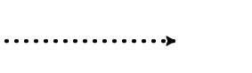
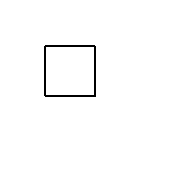
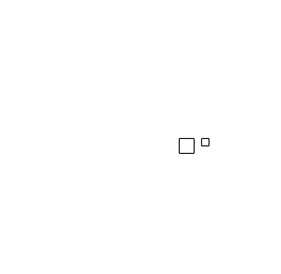
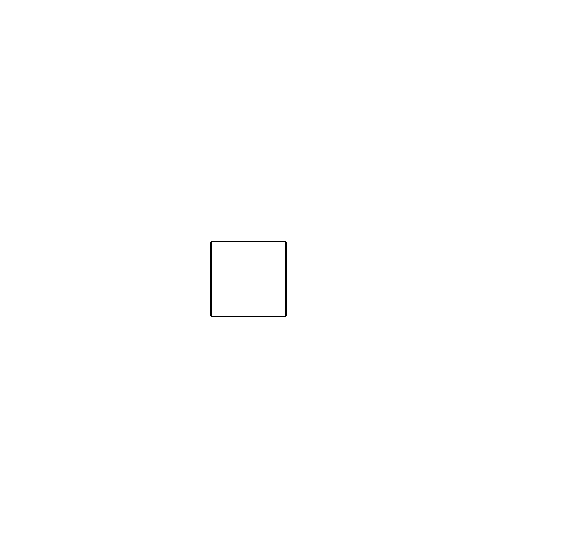

.. _introduction:

Introduction
============

`Superturtle` provides extensions to Python's built-in turtle package which support
richer drawing and animation. This package also provides opportunities to practice 
importing functions and working with code blocks. 

Context managers control how the turtle draws
---------------------------------------------

One important concept used throughout this package is the `context manager`. Just like
a loop, a conditional, or a function declaration, a context manager introduces an
indented code block. While a loop changes how many times a code block runs, a conditional
changes whether the code block runs, and a function assigns a name to a code block, 
the context manager changes how the code block runs. In the example below, we
use the `dots` context manager to cause the turtle to draw with a dotted line::

    from superturtle.stroke import dots
    from turtle import forward, pensize

    pensize(4)
    with dots():
        forward(100)

    
The :ref:`stroke` module contains several other context managers which similarly alter
how the turtle draws, for the duration of their code blocks. These context managers accept
optional arguments. For example, `dots` accepts an integer which controls the spacing between 
dots.

The :ref:`movement` module contains two context managers which affect how the turtle moves. 
`restore_state_when_finished` saves the turtle's position and heading, runs the code block, and 
then restores the prior state when the code block is complete. `no_delay` causes the code block 
to draw instantly, which is helpful for large complex drawings. 

Saving turtle drawings
----------------------

The :ref:`image` module has a `save` function, which saves the current canvas as an image, using the 
given filename. 

Creating animations
-------------------

The most powerful and complex function in `Superturtle` is `animate`, which allows you to create an
animated image and to save it as a gif. (If you want to save an animation, pass `animate` the optional 
argument `gif_filename`.)

Every animation is a sequence of still images (called frames), played at
a certain speed to create the perception of motion. Usually, you want each frame to differ a bit from 
the previous frame. The most effective way to accomplish this is to use a drawing function which is
parametrized. That is, the drawing function takes in one or more numbers, and uses those to create
the drawing. As the numbers change, the drawing changes accordingly. The animate function takes inputs 
describing your desired animation (e.g. the total number of frames in your animation; whether it should loop)
and yields a sequence of frames. Each frame knows its place in the animation and can provide interpolated
numbers for your functions. Here's an example::

    from superturtle.animation import animate
    from turtle import forward, right
    
    def square(side_length):
        for side in range(4):
            forward(side_length)
            right(90)

    for frame in animate(40, loop=True):
        size = frame.interpolate(50, 100, mirror=True)
        square(size)

Frames also provide context managers which interpolate transformations. Within these transformations' 
code blocks, the canvas can be rotated, translated, and scaled. This allows you to create richly-detailed
animations with very little code. Here's an example::

    for frame in animate(60, loop=True):
        with frame.rotate(0, 360):
            penup()
            forward(100)
            pendown()
            square(40)
            with frame.rotate(0, 360, cycles=2):
                penup()
                forward(60)
                pendown()
                square(20)

Easing
------

The examples above show how `animate` provides interpolation, smoothly changing the size, rotation, or other
properties. But what if you don't want a smooth transition with a constant rate of change? Easing functions
specify different rates of change, and can be imported from :ref:`easing`. Here's an example::

    from easing_functions.easing import easeOutBounce

    def rect(width, height):
        for i in range(2):
            forward(width)
            right(90)
            forward(height)
            right(90)

    for frame in animate(60, loop=True):
        with frame.translate([-100, 50], [100, 50], easing=easeOutBounce):
            width = frame.interpolate(100, 40, easing=easeOutBounce)
            rect(width, 100)

